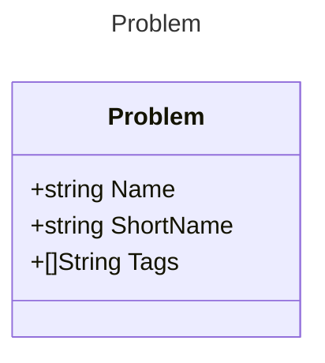

## Problem directory structure
```
+-- problem.json // simple version with only needed properties
+-- statement.pdf
+-- checker
+-- tests/
|   +-- input/
|   +-- output/
```

## API Schema

### POST /problem/add

### GET /problem/get?ProblemId
Return 

```json
{
  "problem-id": "...",
  "name": "...",
  "short-name": "...",
  "tags": [
    "...",
    "..."
  ]
}
```